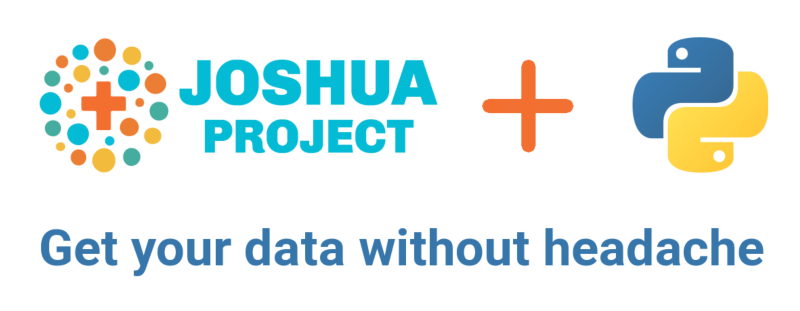

# Joshua Project Python Library
> This is a Python library to help one use APIv2 to fetch the data from the database JoshuaProject.net web site.




This library uses [Joshua Project's APIv2](https://joshuaproject.net/api/v2).
You'll need an **`api_key`** to use API and the library.
For details, see [**Documentation**](https://joshuaproject.net/api/v2/documentation).

## Install

`pip install joshuaproject`

## How to use

Get your [API key](https://joshuaproject.net/api/v2) and set it in a variable or pass to functions.

### Country Codes

Joshua Project uses **FIPS** codes (*US Federal Information Processing Standard*) for countries. 
> [FIPS 10-4](https: //www.wikiwand.com/en/FIPS_10-4) (April 1995) -- Countries, Dependencies, Areas of Special Sovereignty, and TheirPrincipal Administrative Divisions. 

However, FIPS 10-4 was [withdrawn by NIST](https://www.nist.gov/system/files/documents/itl/FIPSCodesReplacementChart2015.pdf)  on September 2, 2008 in favor of the international [**ISO 3166** standard](https://www.iso.org/iso-3166-country-codes.html). 

In the meantime, as of Jan 2020 Joshua Project has no plans to switch onto ISO codes, I was notified. *sigh*

Sadly, FIPS in **60%** cases differs from the ISO.

```
cc = CountryCodes()
diff = cc.data[cc.data.FIPS != cc.data.ISO]
len(diff)/len(cc)
```


    0.6024096385542169


```
diff.head()
```


<div>
<style scoped>
    .dataframe tbody tr th:only-of-type {
        vertical-align: middle;
    }

    .dataframe tbody tr th {
        vertical-align: top;
    }

    .dataframe thead th {
        text-align: right;
    }
</style>
<table border="1" class="dataframe">
  <thead>
    <tr style="text-align: right;">
      <th></th>
      <th>cname</th>
      <th>FIPS</th>
      <th>ISO</th>
    </tr>
  </thead>
  <tbody>
    <tr>
      <td>1</td>
      <td>Aland Islands</td>
      <td>NaN</td>
      <td>AX</td>
    </tr>
    <tr>
      <td>3</td>
      <td>Algeria</td>
      <td>AG</td>
      <td>DZ</td>
    </tr>
    <tr>
      <td>4</td>
      <td>American Samoa</td>
      <td>AQ</td>
      <td>AS</td>
    </tr>
    <tr>
      <td>5</td>
      <td>Andorra</td>
      <td>AN</td>
      <td>AD</td>
    </tr>
    <tr>
      <td>7</td>
      <td>Anguilla</td>
      <td>AV</td>
      <td>AI</td>
    </tr>
  </tbody>
</table>
</div>


**Solution:** The library provides a [`CountryCodes()`](https://kdorichev.github.io/joshuaproject/countrycodes/) class to workaround this discrepancy.

#### Missing FIPS codes

Missing FIPS values:

```
cc.data[cc.data.FIPS.isna()]
```


<div>
<style scoped>
    .dataframe tbody tr th:only-of-type {
        vertical-align: middle;
    }

    .dataframe tbody tr th {
        vertical-align: top;
    }

    .dataframe thead th {
        text-align: right;
    }
</style>
<table border="1" class="dataframe">
  <thead>
    <tr style="text-align: right;">
      <th></th>
      <th>cname</th>
      <th>FIPS</th>
      <th>ISO</th>
    </tr>
  </thead>
  <tbody>
    <tr>
      <td>1</td>
      <td>Aland Islands</td>
      <td>NaN</td>
      <td>AX</td>
    </tr>
    <tr>
      <td>27</td>
      <td>Bonaire, Sint Eustatius and Saba</td>
      <td>NaN</td>
      <td>BQ</td>
    </tr>
    <tr>
      <td>236</td>
      <td>United States Minor Outlying Islands</td>
      <td>NaN</td>
      <td>UM</td>
    </tr>
  </tbody>
</table>
</div>


```
cc.like('French')
```


    [{'cname': 'French Guiana', 'FIPS': 'FG', 'ISO': 'GF'},
     {'cname': 'French Polynesia', 'FIPS': 'FP', 'ISO': 'PF'},
     {'cname': 'French Southern Territories', 'FIPS': 'FS', 'ISO': 'TF'}]


For more details, see the [Country Codes page](https://kdorichev.github.io/joshuaproject/countrycodes/).

### URL Constructing Functions

There are a few functions to easily construct URLs to query then for the info required.

#### Get all people groups in a specific country

Build an URL to query all people groups in India:

```
url_pgs_cntry('IN',api_key=api_key)
```


    'https://joshuaproject.net/api/v2/people_groups?ROG3=IN&api_key=your_api_key'


For more details, see the [URL Functions page](https://kdorichev.github.io/joshuaproject/url/).

## Development

All phases of development (coding, testing, documentation -- autogenerated) are being done completely inside Jupyter Notebooks, thanks to the excellent tool [nbdev](https://nbdev.fast.ai/) by [Fast.ai](https://www.fast.ai/) team.

## Testing

Tests are incorporated into the Jupyter Notebooks and are also a neat way to learn the function's expected behavior, since in case of incorrect behavior `test_*` functions will return an **AssertionError**.

Tests can also be launched from the console with `nbdev_test_nbs`.

## Contributing

Ideas, issues and pull-requests are welcome! Please submit via [GitHub](https://github.com/kdorichev/joshuaproject).

Please share, like and upvote, too.

## Copyright

Copyright 2020 onwards, Konstantin Dorichev. Licensed under the Apache License, Version 2.0 (the "License"); you may not use this project's files except in compliance with the License. A copy of the License is provided in the LICENSE file in this repository.
